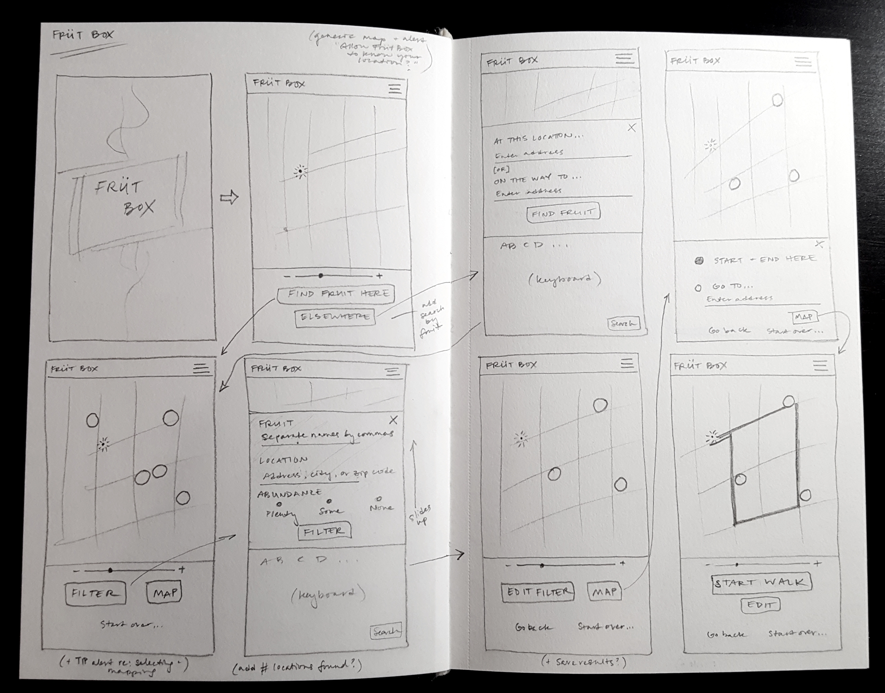

## Früt Box

**The Idea:** An app that tracks the location of publicly available fruit in urban settings.

**Type of Site:** Progressive Web App (PWA)

#### Key Functions:
* Ability to search by fruit and location
* Ability to add a location and fruit (or herb)
  * Drop a pin
  * Add abundance rating
  * Add brief note
* Create simple user profile (if desired)
* Log in to comment or drop a pin, or use as Guest
* Ability to claim as your tree ('have at it' or 'don't touch')
* Info about app + basic instructions for use

#### Key Design Decisions:
* Who is key demographic?
* Will there be custom icons for fruit? How to deal with an unknown or rare item?
* What will color scheme be?
* What is the typical way people would use this app?

#### Tools to use:
* React
* TDD
* SASS
* Google Maps APIs
* Surge (web hosting)